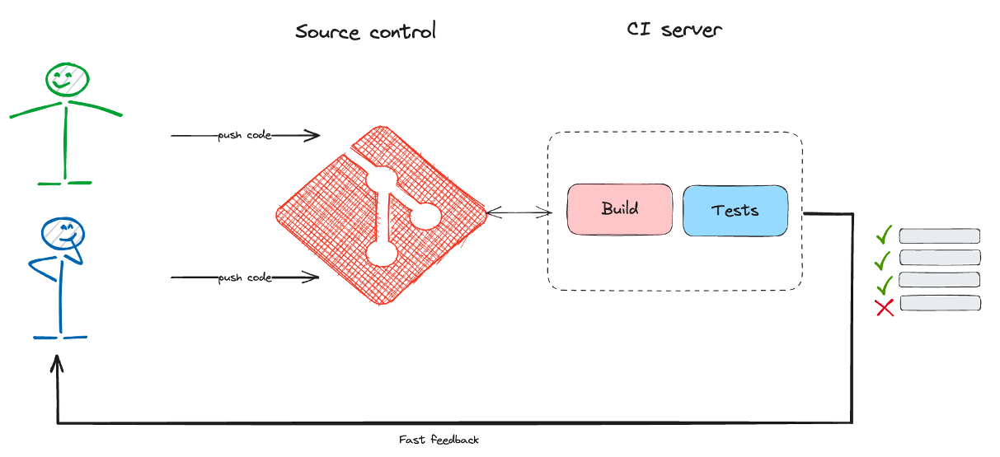
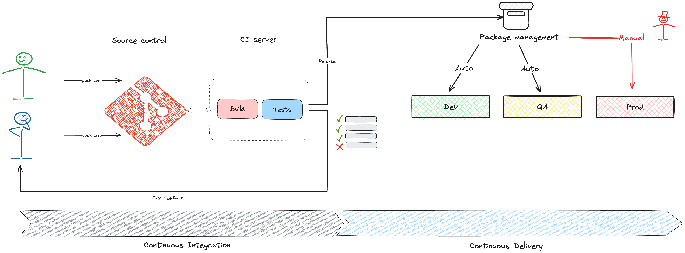
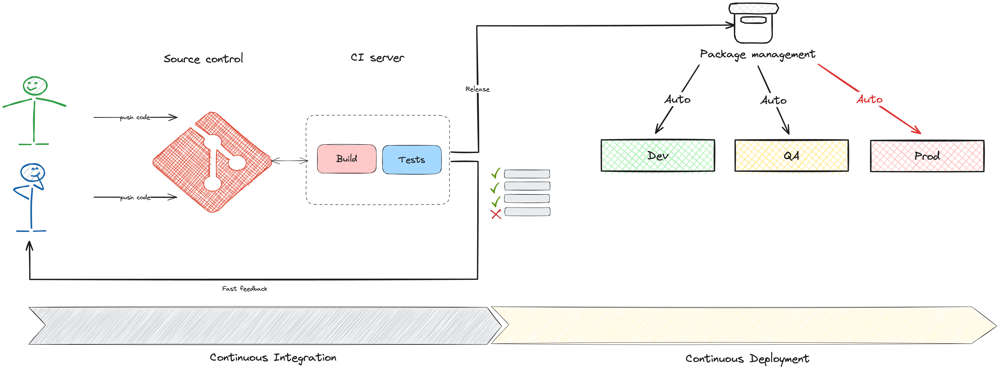

# Continuous Integration (CI) & Continuous Delivery (CD)

## Was bedeutet CI/CD?

CI/CD beschreibt einen automatisierten Weg, wie Software-Änderungen zuverlässig, schnell und häufig ausgeliefert werden können. Ziel ist es, Risiken früh zu erkennen und den Auslieferungsprozess zu vereinfachen und abzusichern.

---

## Continuous Integration (CI)

Bei **Continuous Integration** geht es darum, Codeänderungen **kontinuierlich** in das zentrale Repository zu integrieren. Jeder Commit löst automatisch Builds und Tests aus.

**Ziele:**

* Frühe Fehlererkennung durch automatisiertes Testen
* Schnelleres Feedback für Entwickler
* Reduzierung von Integrationskonflikten

**Best Practices:**

* Kleine, häufige Commits
* Automatisierte Unit- und Integrationstests
* Qualitätssicherung durch Linter und Code-Analyse

---

## Continuous Delivery (CD)

**Continuous Delivery** erweitert CI um die Fähigkeit, Software **jederzeit in eine Staging- oder Produktionsumgebung** auszuliefern – **auf Knopfdruck**.

**Merkmale:**

* Getestete Artefakte werden automatisiert bereitgestellt
* Manuelles Go-Live durch einen kontrollierten Freigabeprozess
* Infrastruktur kann automatisiert provisioniert werden (Infrastructure as Code)

**Nutzen:**

* Bereitstellungsprozesse werden reproduzierbar und sicher
* Änderungen können schneller in Wert umgesetzt werden

---

## Continuous Deployment

**Continuous Deployment** geht noch einen Schritt weiter: Jede Änderung, die alle Tests erfolgreich durchläuft, wird **automatisch in Produktion** ausgerollt – ohne manuelle Freigabe.

**Voraussetzungen:**

* Sehr hoher Automatisierungsgrad
* Monitoring und schnelles Rollback
* Feature Toggles, um Releases kontrolliert zu gestalten

**Vorteile:**

* Maximale Geschwindigkeit in der Auslieferung
* Schnelle Reaktion auf Kundenfeedback und Marktveränderungen

---

## Fazit

CI/CD ist das Rückgrat moderner Softwarebereitstellung. Es ermöglicht:

* Häufigere, stabilere Releases
* Frühes Feedback
* Höhere Entwicklerzufriedenheit
* Geringere Risiken bei Auslieferung

> Tipp: CI/CD ist ein Weg, kein Ziel. Beginnt mit CI, etabliert gute Testpyramiden – und erweitert dann schrittweise Richtung Delivery und Deployment.
