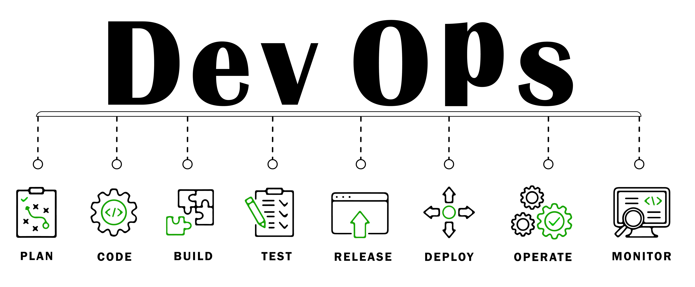
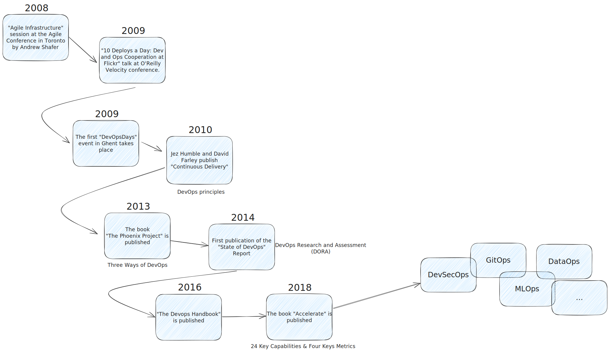

# Einführung in DevOps

DevOps ist mehr als nur ein technischer Ansatz – es ist eine **Kultur**, die auf **Zusammenarbeit**, **Automatisierung** und **kontinuierlicher Verbesserung** basiert. Im Kern geht es darum, Silos zwischen Entwicklung (Development) und Betrieb (Operations) aufzubrechen, um Software schneller, sicherer und zuverlässiger bereitzustellen.

Ein zentrales Modell dafür ist **CALMS**: Culture, Automation, Lean, Measurement, Sharing.

---

## Von Wasserfall zu Agile zu DevOps: Eine Reise

### Wasserfall

Ein lineares Vorgehensmodell mit sequentiellen Phasen wie Anforderungsanalyse → Design → Entwicklung → Test → Betrieb. Lange Zeit galt es als Standard.

**Vorteile:**

* Klar strukturierter Ablauf
* Gute Planbarkeit bei stabilen Anforderungen

**Nachteile:**

* Keine Flexibilität bei Änderungen
* Feedback erst spät möglich
* Gefahr von Fehlentwicklungen, die spät erkannt werden

---

### Agile

Seit den 2000ern etablieren sich agile Methoden wie Scrum und Kanban. Im Zentrum stehen **iteratives Vorgehen**, **Kundennähe** und **laufendes Feedback**.

**Leitsätze des Agilen Manifests:**

1. Menschen und Interaktionen über Prozesse und Werkzeuge
2. Funktionierende Software über umfassende Dokumentation
3. Zusammenarbeit mit dem Kunden über Vertragsverhandlung
4. Reagieren auf Veränderung über das Befolgen eines Plans

**Ziel:** Schneller Mehrwert für den Kunden durch inkrementelle Entwicklung.

---

### DevOps

DevOps erweitert agile Prinzipien über die Entwicklung hinaus bis in den Betrieb. Dabei stehen Automatisierung, Monitoring und gemeinsame Verantwortung im Vordergrund.

**Vorteile:**

* Schnellere Releases (Time-to-Market)
* Höhere Softwarequalität durch automatisiertes Testen und Monitoring
* Gesteigerte Resilienz durch gemeinsame Verantwortung
* Mehr Zufriedenheit bei Kund\:innen und Mitarbeitenden

**Herausforderungen:**

* Kultureller Wandel notwendig (Abbau von Silos)
* Investitionen in Tooling und Know-how
* Neue Verantwortungsmodelle und Kommunikationswege

---

## DevOps-Komplexität verstehen

DevOps bringt viele Disziplinen zusammen: Infrastruktur, Code, Tests, Security, Monitoring – alles wird miteinander verzahnt. Gute Automatisierung reduziert manuelle Reibung, erfordert aber solides Engineering.

---

## Historische Einordnung

DevOps ist aus der Erkenntnis entstanden, dass agile Methoden alleine nicht reichen. Erst wenn auch der Betrieb integriert wird, kann wirkliche Geschwindigkeit und Qualität entstehen.

> „It is not the strongest or the most intelligent who will survive but those who can best adapt to change.“ – Leon C. Megginson

> „DevOps, a movement of people who care about developing and operating reliable, secure, high performance systems at scale, has always – intentionally – lacked a definition or manifesto.“ – John Willis

---

## Weiterführende Ressourcen

* [DevOps Days](https://devopsdays.org/)
* [10 Deploys Per Day – Flickr](https://www.youtube.com/watch?v=LdOe18KhtT4)
* [Continuous Delivery – Humble & Farley](https://www.goodreads.com/book/show/8686650-continuous-delivery)
* [State of DevOps Report – Puppet](https://puppet.com/resources/report/state-of-devops-report)
* [The DevOps Handbook](https://www.goodreads.com/book/show/26083308-the-devops-handbook)
* [Accelerate – Forsgren et al.](https://www.goodreads.com/book/show/39080433-accelerate)
* [The Phoenix Project – Kim et al.](https://www.goodreads.com/book/show/17255186-the-phoenix-project)
