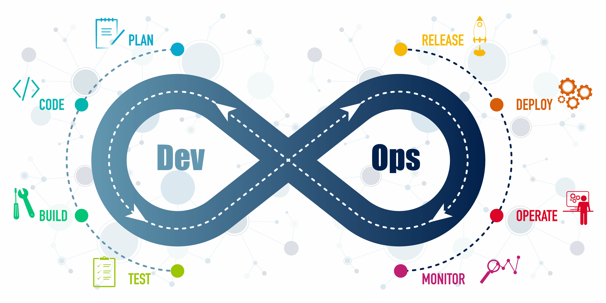
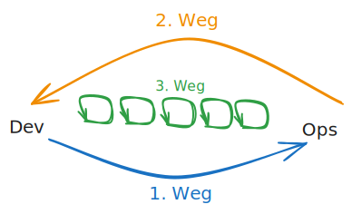
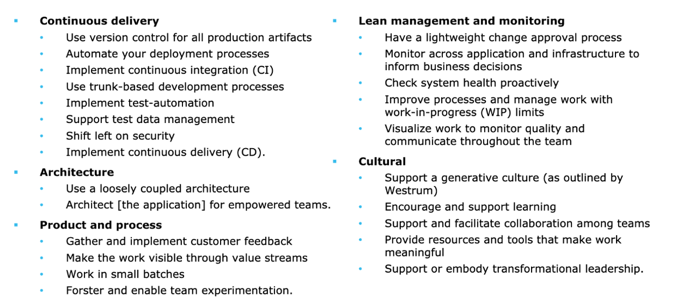

# DevOps – Fortgeschritten

## DevOps Lifecycle

Der DevOps-Lifecycle beschreibt den kontinuierlichen Fluss von Planung, Entwicklung, Test, Bereitstellung, Betrieb und Überwachung. Ziel ist es, durch Automatisierung, Feedback und gemeinsame Verantwortung schneller und stabiler Software auszuliefern.

---

## CALMS – Die DevOps-DNA

Das CALMS-Modell ist ein bewährter Rahmen zur Bewertung und Entwicklung von DevOps-Kultur:

* **C**ulture – Zusammenarbeit, Vertrauen und Verantwortung statt Silos
* **A**utomation – Alles, was wiederholbar ist, wird automatisiert
* **L**ean – Fokus auf Wertschöpfung und Eliminierung von Verschwendung
* **M**easurement – Metriken als Grundlage für Lernen und Steuerung
* **S**haring – Wissen offen teilen, um Lernen und Innovation zu fördern

> Tipp: Nutzt CALMS als Reflexionsrahmen für euer eigenes Team.

---

## Die Drei Wege von DevOps

Die „Three Ways“ stammen aus dem Buch *The Phoenix Project* und sind grundlegende Prinzipien, die alle DevOps-Praktiken untermauern:

### 1. Der Erste Weg – Systemdenken

* Fokus auf den **End-to-End-Fluss** der Arbeit
* Entscheidungen immer im **Systemkontext** treffen, nicht isoliert

### 2. Der Zweite Weg – Feedback-Schleifen verstärken

* **Schnelles Feedback** hilft, Fehler früh zu erkennen
* Feedback in allen Phasen: Code Review, Test, Deployment, Monitoring

### 3. Der Dritte Weg – Lernen und Experimentieren fördern

* **Fehler als Lernchance** verstehen
* Innovation durch sichere Experimente, blameless Postmortems und kontinuierliche Verbesserung

---

## PPT – People, Process, Technology

> “DevOps at a very high-level involves People, Process, and Products/Tools – and in that order intentionally.” – John Willis

Diese Perspektive betont, dass Tools niemals der Anfangspunkt sind. Erst wenn Menschen (Kultur & Rollen) und Prozesse klar sind, entfalten Tools ihren Mehrwert.

* **People:** Kultur, Skills, Zusammenarbeit
* **Process:** Workflows, Automatisierung, Feedbackzyklen
* **Technology:** Werkzeuge zur Unterstützung von Prozessen

---

## 24 Capabilities (nach DORA)

Das DORA-Forschungsmodell („Accelerate“) beschreibt 24 Fähigkeiten, die den Erfolg von High-Performing IT-Teams ausmachen. Diese sind u. a.:

* Automatisierung von Builds, Tests und Deployments
* Monitoring & Observability
* Change Management & Incident Response
* Psychological Safety & Team Empowerment

Mehr dazu in: [Accelerate](https://www.goodreads.com/book/show/39080433-accelerate)

---

## Weiterführende Ressourcen

* [CALMS: The DevOps Culture Model](https://www.atlassian.com/devops)
* [The Three Ways – IT Revolution](https://itrevolution.com/the-three-ways-principles-underpinning-devops/)
* [The Phoenix Project](https://www.goodreads.com/book/show/17255186-the-phoenix-project)
* [Accelerate – Forsgren et al.](https://www.goodreads.com/book/show/39080433-accelerate)
* [The DevOps Handbook](https://www.goodreads.com/book/show/26083308-the-devops-handbook)
