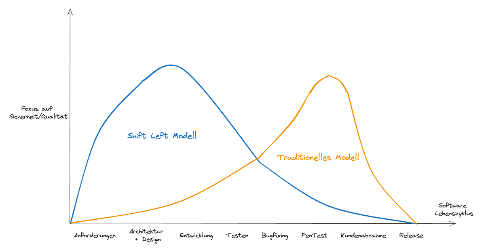
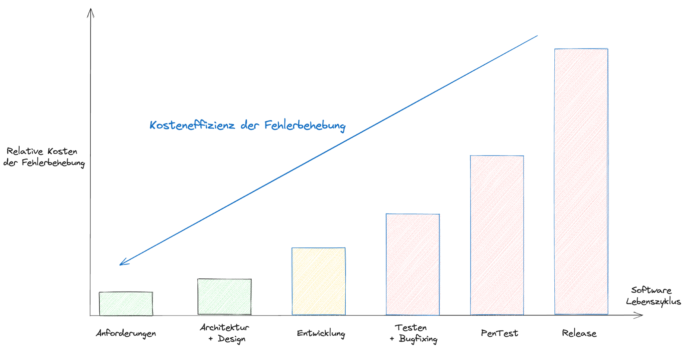
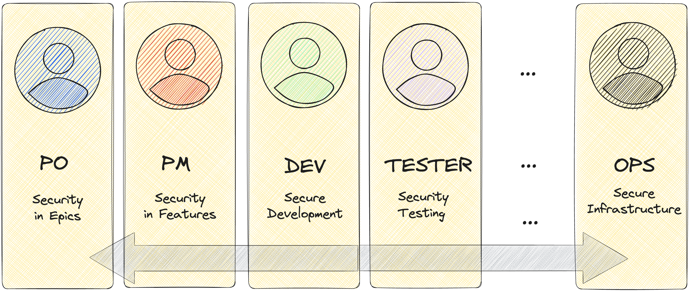

# Integration von Security in DevOps

## Shift Left Security – Sicherheit von Anfang an mitdenken

Die Integration von Security in DevOps beginnt mit dem Prinzip „**Shift Left**“. Sicherheitsaspekte werden dabei **frühzeitig im Entwicklungsprozess** berücksichtigt – nicht erst zum Schluss.

**Vorteile:**

* Risiken werden früh erkannt und kostengünstiger behoben
* Schnelleres Feedback für Entwickler
* Bessere Zusammenarbeit zwischen Dev, Ops und Security
* Höheres Vertrauen durch sichere Produkte

---

## Warum früh testen günstiger ist

Je früher Sicherheitslücken entdeckt werden, desto **niedriger sind die Kosten ihrer Behebung**. Dieser Effekt multipliziert sich in CI/CD-Umgebungen mit täglichen Deployments.

**Zusätzliche Vorteile:**

* Reduktion von „Last-Minute-Panik“ vor Releases
* Automatisierung von Security-Prüfungen (z. B. Dependency Scans, Secrets Detection)
* Förderung der Security-Awareness im Team

---

## Herausforderungen beim Shift Left

* **Geschwindigkeit vs. Gründlichkeit**: Sicherheitsmaßnahmen dürfen nicht zum Bottleneck werden
* **Kulturelle Differenzen**: Security ist oft Kontrollinstanz, Dev-Teams dagegen iterativ getrieben
* **Tool-Sprawl**: Neue Security-Tools müssen in bestehende Pipelines integriert werden
* **Komplexität** moderner Anwendungen (Microservices, Cloud-native)
* **Know-how-Aufbau** ist essenziell

  * [Security Certification Roadmap](https://pauljerimy.com/security-certification-roadmap/)

---

## Rollen & Verantwortlichkeiten

Security ist **Teamverantwortung**. DevOps-Teams übernehmen Sicherheit nicht zusätzlich, sondern **integrieren sie nahtlos** in ihre tägliche Arbeit:

* Entwickler: sichere Codierung, Secrets Handling, Unit-Tests
* Ops: sichere Infrastruktur, Härtung, Monitoring
* Security: Guidelines, Beratung, automatisierte Prüfungen

> Tipp: **Security Champions** im Team helfen, Brücken zu bauen und Verantwortung zu verteilen.

---

## Weiterführende Links

* [Shift Left Security – Snyk](https://snyk.io/learn/shift-left-security/)
* [Shift Left Security – apisec.ai](https://www.apisec.ai/blog/shift-left-security)
* [Security Certification Roadmap – Paul Jerimy](https://pauljerimy.com/security-certification-roadmap/)
