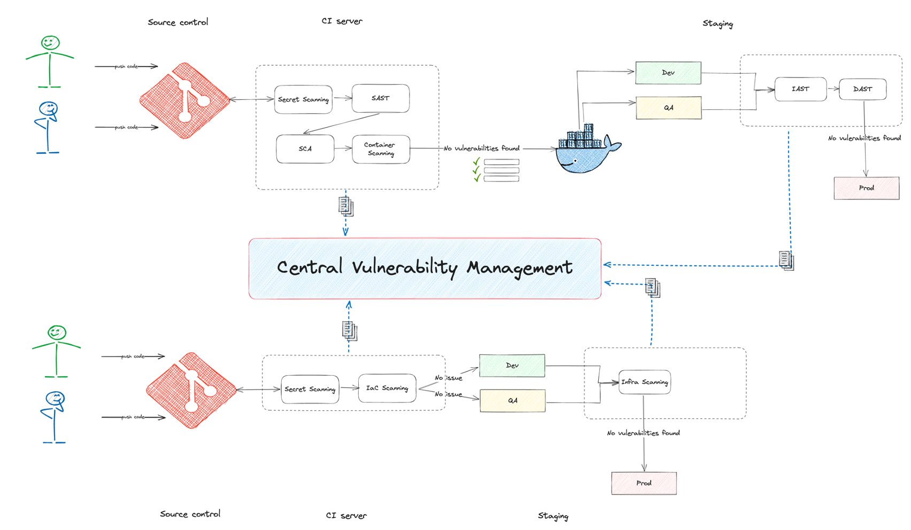

# Supply Chain Security

## Glossar

| Begriff                | Bedeutung                                                                |
|------------------------|--------------------------------------------------------------------------|
| **SAST**               | Static Application Security Testing – Analyse des Quellcodes auf Schwachstellen. |
| **DAST**               | Dynamic Application Security Testing – Test der laufenden Anwendung auf Sicherheitslücken. |
| **IAST**               | Interactive Application Security Testing – Kombination aus statischen und dynamischen Tests während der Laufzeit. |
| **SCA**                | Software Composition Analysis – Analyse von eingesetzten Bibliotheken und Abhängigkeiten auf bekannte Schwachstellen. |
| **IaC**                | Infrastructure as Code – Infrastruktur wird über Code definiert und automatisiert bereitgestellt. |

