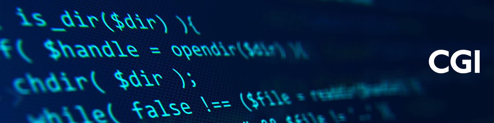
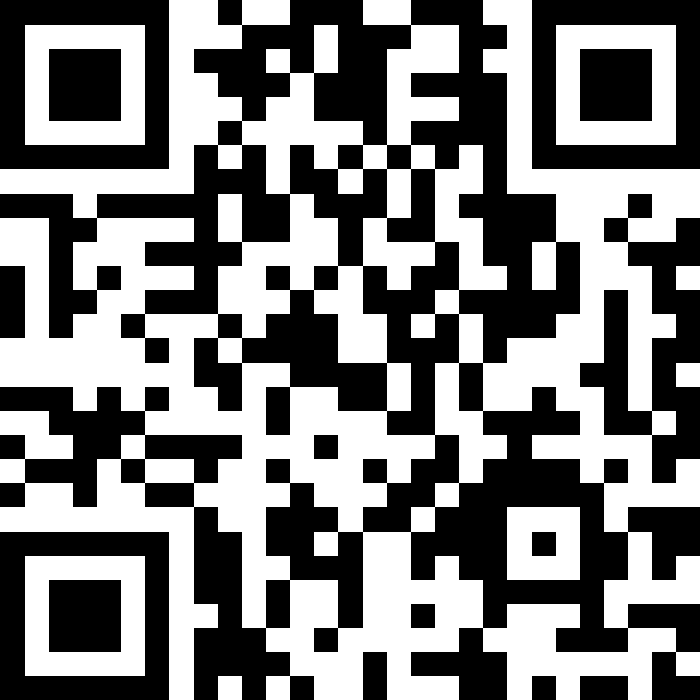

# DevSecOps-Workshop – Agile Sicherheit in der Software-Entwicklung

Willkommen zum interaktiven DevSecOps-Workshop von CGI (ehemals Novatec)!
Dieser Workshop richtet sich an alle, die moderne Softwareentwicklung sicher gestalten wollen – ohne den Flow zu verlieren.

## 🧭 Was erwartet dich?

In einem praxisnahen Format (remote, 9–16 Uhr) lernst du, wie DevOps und Security sinnvoll miteinander verbunden werden können.
Der Workshop gliedert sich in drei Module:

1. **DevOps Essentials** – CI/CD, GitOps, Automatisierung
2. **Secure by Design** – Threat Modeling, Secure Coding, Testautomatisierung
3. **Supply Chain Security** – SBOM, Container Hardening, Compliance

Jedes Modul besteht aus:
- Kurzen Theorieimpulsen
- Hands-on Übungen
- Diskussionen zu Best Practices

## 🛠 Voraussetzungen

- Grundkenntnisse in Softwareentwicklung
- Git-Basiswissen
- Docker oder Container-Erfahrung von Vorteil

## 📂 Inhalte des Repositories

Die Inhalte findest du in den folgenden Ordnern:

- [0_devops/](./0_devops/) – DevOps Grundlagen und Übungen
- [1_security/](./1_security/) – Security Essentials, Automation, Culture
- [2_supplychain/](./2_supplychain/) – Supply Chain Security, Compliance, Tools

## Slido

 \
Slido Code: \
1011222 \
https://app.sli.do/event/xjo7kTazazEY3AxixgNJ8G 
